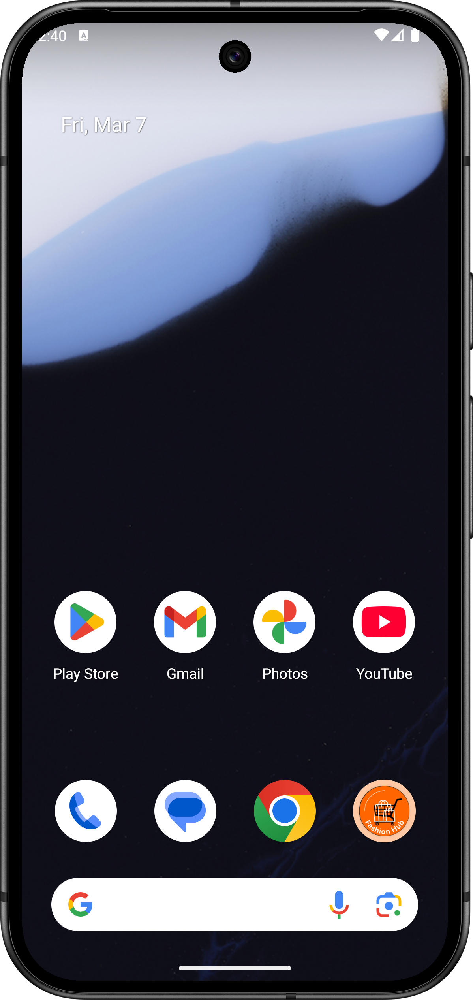
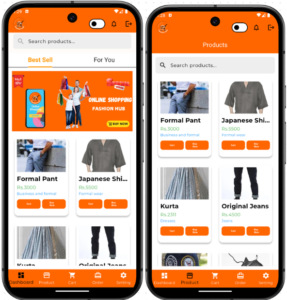
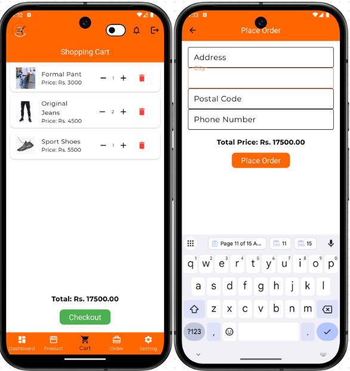

# Fashion Hub Mobile Application 👗📱

## About Fashion Hub 🌍

In a world where fashion is evolving rapidly, Fashion Hub is designed to bridge the gap between users and the latest fashion trends. This mobile application offers a seamless shopping experience, enabling users to explore, purchase, and manage fashion products effortlessly.

Powered by the Flutter framework and Dart programming language, Fashion Hub follows the Clean Architecture approach for scalability, maintainability, and efficient data management. The backend is built using Node.js with Express (Middleware) and MongoDB, ensuring fast and reliable service. Additionally, Hive is used for local storage to enhance app performance.

Whether you are a casual shopper or a fashion enthusiast, Fashion Hub delivers a tailored experience for discovering and buying the latest styles effortlessly.

## Key Features 🌟

Personalized Shopping Experience 🛍️

Smart product recommendations based on user preferences, shopping history, and trends.

User profiles with saved preferences for a seamless shopping journey.

# Fashion Marketplace 🏪

Wide collection of fashion items, including clothing, and footwear.

Users can track their orders in real-time and manage their shopping carts effortlessly.

Store owners can upload, update, and delete products easily.

# Wishlist & Favorites 💖

Save favorite products for easy access and future purchases.

Modern Tech Integration 🛠️

Flutter-based cross-platform app for Android and iOS.

Clean Architecture ensures separation of concerns, making the app maintainable and scalable.

Hive local storage for smooth offline access and performance optimization.

# Aims and Objectives 🎯

## Aims:

To create a seamless and engaging fashion shopping experience through mobile technology.

To provide a platform where users can explore and purchase fashion products effortlessly.

## Objectives:

Deliver a user-friendly interface that enhances the online shopping experience.

Implement AI-powered recommendations to personalize product suggestions.

Ensure seamless order tracking and inventory management.

Use Clean Architecture for better maintainability and scalability.

## Technology Stack 🛠️

Frontend: Flutter (Dart)

Backend: Node.js with Express (Middleware)

Database: MongoDB

Local Storage: Hive

##Tools:

Figma (UI/UX Design)

Draw.io (Prototyping and System Design)

## Clean Architecture Overview 🏗️

Clean Architecture is used to ensure the separation of concerns, making the application scalable and easy to maintain.

Domain Layer: Contains business logic, use cases, and core entities.

Data Layer: Manages API integrations, local storage, and repositories.

Presentation Layer: Handles UI and state management.

Infrastructure Layer: Manages external services and dependencies.

This structure ensures:
✅ High modularity and maintainability
✅ Scalability for future features and integrations
✅ Better performance with efficient data management

#Conclusion 🌿

The Fashion Hub Mobile Application is more than just an online shopping platform—it’s a smart and engaging way to explore fashion trends effortlessly. By integrating modern technologies, a clean and scalable architecture, and a user-centric design, Fashion Hub is revolutionizing the online fashion shopping experience. 🛍️✨

## 📸 App Screenshots

|  |
|:--:|
| App Icon |

|  |
|:--:|
| Dashboard and Products Screen |

|  |
|:--:|
| Order History and Setting Screen |
